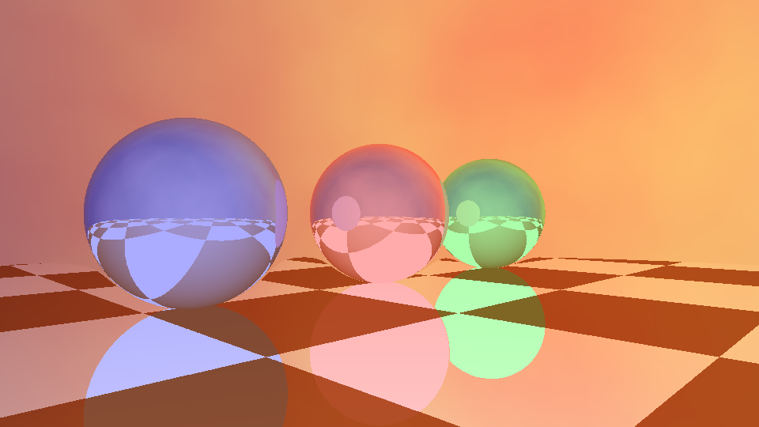

# Lab 02: Debugging

**Team members:** Zhuoyang Pan, Yao Tang

**Shadertoy solution:** [Lab 02 Debugging](https://www.shadertoy.com/view/NXdGzs)

This lab started with a [broken shader](https://www.shadertoy.com/view/flGfRc) of three reflective spheres over a patterned floor. The goal was to find the bugs and reproduce the [reference video](https://github.com/user-attachments/assets/281fe7ff-1145-4a94-b7c2-b05a31d943cc). The changes are in [image.glsl](shaders/image.glsl); [common.glsl](shaders/common.glsl) is unchanged.

## Bugs and fixes

### 1. `vec` should be `vec2`

The shader initially failed to compile at `vec uv2`. The compiler reported that `vec` was undefined. Since the expression produces two coordinates, changing the type to `vec2` fixed this error.

### 2. The camera used the wrong UV coordinates

`mainImage` calculated `uv2` in the range `[-1, 1]`, but still passed `uv`, which ranges from `[0, 1]`, into `raycast`. Following the center pixel through the calculation exposed the problem: it reached the camera as `(0.5, 0.5)`, even though `(0, 0)` is what points at the center of the scene. The call now uses `raycast(uv2, dir, eye, ref)`.

### 3. The aspect ratio was always 1

The horizontal camera vector was scaled by `iResolution.x / iResolution.x`. Both values are the width, so the ratio cancels out. This explains why the scene stretches in a rectangular window. Changing the denominator to `iResolution.y` accounts for the actual width and height. Checking the center sphere at landscape, square, and portrait resolutions confirmed that it stays circular.

### 4. The reflection used a position instead of a direction

Tracing the reflection calculation led to `reflect(eye, nor)`. Here, `eye` is the camera's position, while `reflect` needs the incoming ray direction. It also has length 15 in this scene, which makes the ray marcher take incorrectly scaled steps. Replacing it with `reflect(dir, nor)` gives the correct reflected direction and preserves the unit length expected by the marcher.

### 5. The reflected hit overwrote the first hit

Inside `sdf3D`, the second ray march reused `t` and `hitObj`, and its normal replaced `nor`. Following those variables to the end of the function showed two problems: the Fresnel calculation could use the reflected surface's normal, and the returned intersection mixed the first hit's position with the second hit's distance and object ID.

The reflection now has its own `reflectedT`, `reflectedObj`, and `reflectedNormal`. This keeps the first surface's normal available for Fresnel and preserves the original intersection. The reflected hit position also includes the same `0.01` offset used to start the second ray, so both calculations use the same origin.

## Result

The corrected shader compiles in Shadertoy and in WebGL 2. It was checked at `960 x 540`, `640 x 640`, and `540 x 960`, and at several points in the camera animation. A separate diagnostic compared the first ray hit with the intersection returned after reflection; their distances, positions, and object IDs agreed at every tested pixel.

The render below shows the colored spheres, floor reflections, and sky after the fixes, at `iTime = 47.12` seconds.

