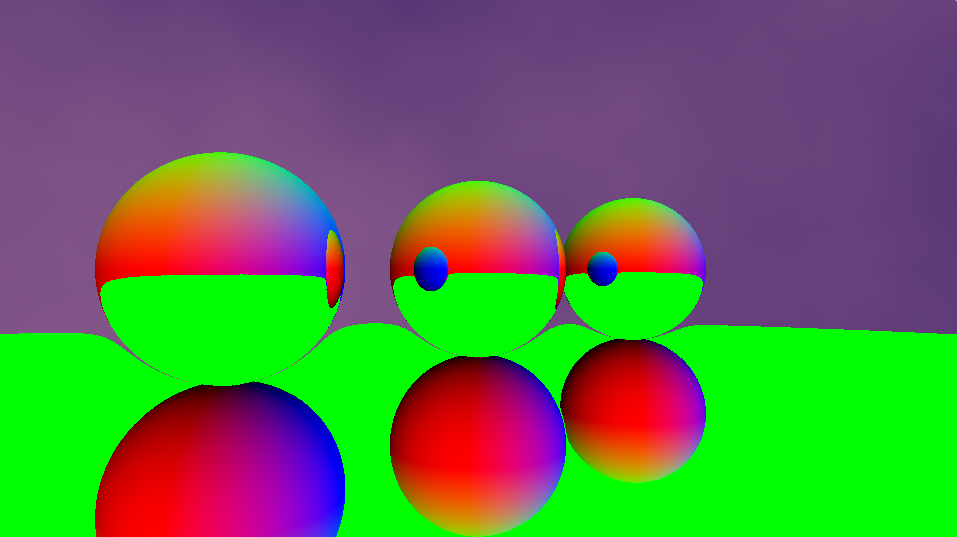
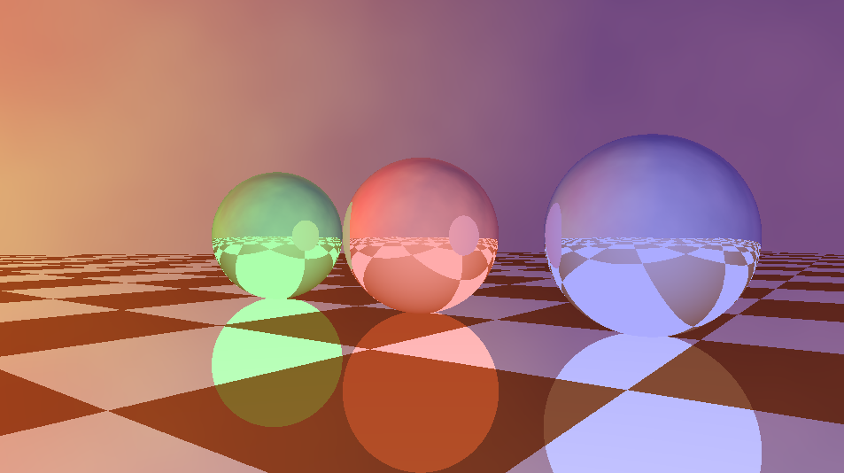

# lab02-debugging

[Solution](https://www.shadertoy.com/view/NX33zs)

## Team Members

- Sizhe Liu

## Bugs Found

### 1. Incorrect `uv2` type

The shader did not compile because `vec` is not a valid GLSL type. The compiler reported `'vec': undeclared identifier` and a syntax error near `uv2`.

```glsl
// Before
vec uv2 = 2.0 * uv - vec2(1.0);

// After
vec2 uv2 = 2.0 * uv - vec2(1.0);
```

I found this bug by reading the compiler error messages.

### 2. Wrong UV coordinates passed to `raycast`

The shader calculated `uv2`, but passed `uv` to `raycast`. This used coordinates from `[0, 1]` instead of the expected `[-1, 1]`.

```glsl
// Before
raycast(uv, dir, eye, ref);

// After
raycast(uv2, dir, eye, ref);
```

I found this bug by checking where `uv2` was used after it was calculated.

### 3. Incorrect aspect ratio

The spheres were stretched along the y-axis, which suggested an aspect-ratio problem. The horizontal scale divided `iResolution.x` by itself, which always equals `1.0`.

```glsl
// Before
H *= len * iResolution.x / iResolution.x;

// After
H *= len * iResolution.x / iResolution.y;
```

I found this bug by inspecting the code that uses the window resolution.

### 4. Incorrect reflection direction

The spheres and floor did not show the expected reflections. The code passed the camera position to `reflect` instead of the incoming ray direction.

```glsl
// Before
dir = reflect(eye, nor);

// After
dir = reflect(dir, nor);
```

I found this bug by tracing the reflection calculation and checking the arguments passed to `reflect`.

### 5. Primary intersection variables were overwritten

The reflection ray reused `t`, `hitObj`, and `nor` from the primary ray. As a result, the final intersection contained data from the reflected object.

```glsl
float tRef;
int hitObjRef;

march(isect + dir * 0.01, dir, tRef, hitObjRef);

if (hitObjRef != -1) {
    vec3 isect2 = isect + tRef * dir;
    vec3 norRef = computeNormal(isect2);
    specReflCol = computeMaterial(hitObjRef, isect2, dir, norRef);
}
```

I found this bug by displaying the normals as the output color:

```glsl
return Intersection(t, nor, isect, hitObj);
```

The floor incorrectly displayed normals from the reflected spheres.



## Additional Improvement

The original ray marcher only performed 64 iterations, causing parts of the floor to disappear before the rays reached them. Increasing the limit to 256 allowed more tiles to render.

```glsl
// Before
for (int i = 0; i < 64; ++i)

// After
for (int i = 0; i < 256; ++i)
```

This may not be one of the intended five bugs, but it improved the final result.

## Final Result

After correcting the bugs, the shader renders with the correct proportions, reflections, and floor coverage.

